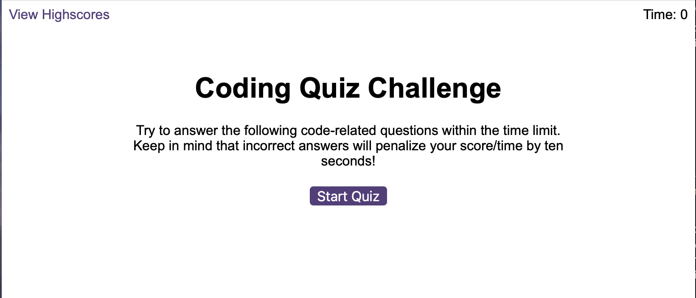
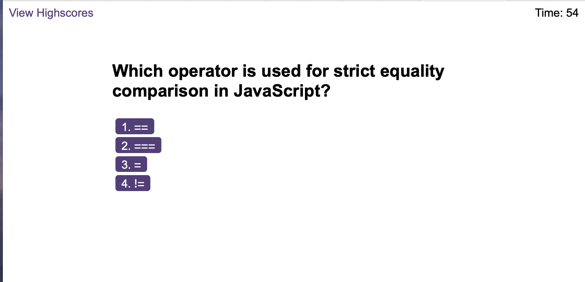
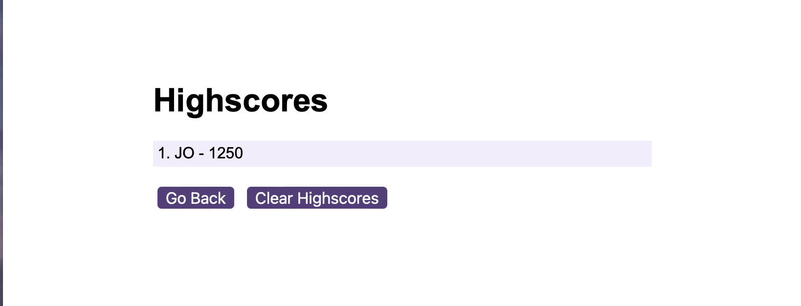

# JavaScript Quiz Game

## Description & Usage 

This is a timed quiz game on the JavaScript programming language. Each question has 4 potential answers, if the correct answer is selected then your score will increase. If an incorrect answer is chosen then your score will decrease and 10 seconds will be deducted from the timer. If all questions have been answered or the timer hits zero then the game ends and your final score is calculated. Note that the faster you complete the answer the larger your score will be as there is a score multiplier applied to the final score depending on the time left on the clock. If your score falls bellow zero then your final score will be zero. After entering your initials on the game end screen your score will be saved in local storage and you will be taken to the highscores screen where all stored scores will be displayed. From here you can delete all the scores from local storage. 

[Deployed Application](https://korrin-f.github.io/javascript-quiz-game/index.html)

Follow the link above to play the quiz game. 

## License

See the licence in the repo.

## Badges

